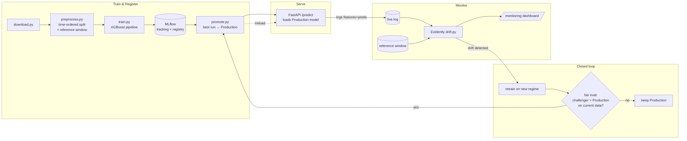

# Real-Time MLOps Fraud Detection & Drift Monitoring

[](.github/workflows/ci.yml)

An **end-to-end production ML system** that doesn't just train a model — it
**owns one in production**. It serves real-time fraud predictions, monitors the
incoming data for drift, and **closes the loop**: detected drift triggers a
retrain, the challenger is promoted **only if it genuinely beats** the model in
production, and the API picks up the new version — all runnable on a laptop with
`docker compose up`.

> **Result:** Detects credit-card fraud in real time at **test PR-AUC 0.77**
> (precision 0.87 / recall 0.75) on a brutally imbalanced ~0.17%-positive
> dataset — and **auto-retrains and re-promotes when the data drifts.**

---

## Architecture — the closed loop



---

## Live demo

**▶ [Live demo on Hugging Face Spaces](https://huggingface.co/spaces/<your-username>/fraud-detection-realtime)**
*(deploy it yourself in ~5 min — see [DEPLOY.md](DEPLOY.md))*

On the demo: click **"Simulate a drift event"**, then open the live drift report
to watch it flip from *no drift* → *drift detected*. Try `POST /predict` live in
the Swagger UI at `/docs`.

### Recording the demo GIF (drift → retrain → promote)

A 30–60s GIF makes this land. To record it on Windows:

1. Install [ScreenToGif](https://www.screentogif.com/) (free).
2. Bring the stack up and seed a model:
   ```powershell
   docker compose up -d --build
   docker compose run --rm train
   docker compose run --rm train python -m src.registry.promote
   ```
3. Open the monitor at <http://localhost:8050> in a browser. Start the
   ScreenToGif recorder over the browser + a terminal.
4. Run the simulator and watch the dashboard flip:
   ```powershell
   docker compose run --rm simulate
   ```
5. Run the closed loop and capture the event log promoting `v2` + the API
   reloading:
   ```powershell
   docker compose run --rm loop
   ```
6. Stop recording, export as `docs/demo.gif`, and embed it here:
   ``.

---

## Metrics (honest, imbalance-aware)

Class balance is stated up front: **fraud is ~0.17% of transactions** — so
**accuracy is never reported**; PR-AUC is the headline metric.

| Metric | Validation | Test |
|---|---|---|
| **PR-AUC** (primary) | **0.844** | **0.767** |
| ROC-AUC | 0.980 | 0.977 |
| Precision | 0.935 | 0.867 |
| Recall | 0.782 | 0.750 |
| F1 | 0.852 | 0.804 |

*Test confusion matrix: TP=39, FP=6, FN=13, TN=42,502.*
Imbalance is handled with `scale_pos_weight` (≈542), **not** naive SMOTE.

**Closed-loop proof:** after a drift event, the incumbent model degrades to
**PR-AUC 0.457** on the current (drifted) data, while a challenger retrained on
the new regime scores **0.769** — so promotion to a new version is justified and
happens automatically. Re-running with no real improvement leaves Production
unchanged (the gate holds).

---

## Quickstart — one command + a few jobs

**Requirements:** Docker Desktop. Everything runs in containers (Python 3.11).

```powershell
# 1. Bring up the stack: MLflow (:5000), API (:8000), Monitor (:8050)
docker compose up -d --build

# 2. Train the baseline and promote it to Production
docker compose run --rm train                                   # download → preprocess → train
docker compose run --rm train python -m src.registry.promote    # best run → Production

# 3. Tell the API to load the freshly promoted model
curl -X POST http://localhost:8000/reload

# 4. Predict (or open http://localhost:8000/docs)
#    See a sample request in the Swagger UI.

# 5. Simulate live traffic with an injected drift event → watch http://localhost:8050
docker compose run --rm simulate

# 6. Run the closed loop: drift → retrain → promote-if-better → serve
docker compose run --rm loop

# Lint + tests (same as CI)
docker compose run --rm test
```

### Services & endpoints

| Service | URL | Endpoints |
|---|---|---|
| Inference API | http://localhost:8000 | `/predict`, `/health`, `/model-info`, `/reload`, `/docs` |
| Drift monitor | http://localhost:8050 | `/` (badge), `/monitoring` (Evidently report), `/drift-summary` |
| MLflow | http://localhost:5000 | runs, metrics, model registry |

---

## Tech stack & what each piece does

| Layer | Tool | Role here |
|---|---|---|
| Model | **XGBoost** + scikit-learn pipeline | Tabular fraud classifier; feature engineering + scaling live *inside* the pipeline for train/serve parity |
| Tracking + registry | **MLflow** | Logs runs/metrics/artifacts; registry holds the `Production` model (SQLite backend + proxied artifact store) |
| Inference API | **FastAPI** + Pydantic + Uvicorn | Loads the `Production` model at startup; `/reload` hot-swaps a newly promoted version |
| Drift monitoring | **Evidently** | Compares the reference window vs the live prediction log; emits the drift signal the loop acts on |
| Dashboard | FastAPI-served Evidently HTML | Live `/monitoring` report that flips to "drift detected" |
| Orchestration | **Docker Compose** | One-command multi-service stack |
| CI / retraining | **GitHub Actions** | [`ci.yml`](.github/workflows/ci.yml): ruff + pytest on every push. [`retrain.yml`](.github/workflows/retrain.yml): scheduled + manual retrain-and-promote-if-better |

### Why the closed loop is honest (not faked)

A naive loop that retrains on identical data can never promote — an equal model
shouldn't replace the incumbent, and the gate correctly rejects it. The real
mechanism: drift means **new labeled data has arrived**. The challenger learns
the new regime, and the promotion gate **re-scores the incumbent and the
challenger on the same current evaluation set** rather than comparing PR-AUC
values logged against different validation sets. That's why the incumbent
visibly degrades on drifted data and the challenger's promotion is earned.

---

## Repository layout

```
src/
├── config.py            # all paths, thresholds, hyperparameters (one place)
├── data/                # download.py, preprocess.py, drifted.py
├── train/               # train.py, evaluate.py
├── registry/            # promote.py (best-run + only-if-better gate)
├── serve/               # app.py, schemas.py, deploy.py (single-container demo)
├── monitor/             # drift.py, dashboard.py, live_log.py
├── simulate/            # stream.py (traffic + injected drift)
└── loop/                # run_loop.py (the closed loop)
tests/                   # test_preprocess.py, test_api.py, test_drift.py
deploy/                  # Dockerfile + HF Space config (see DEPLOY.md)
.github/workflows/       # ci.yml, retrain.yml
docker-compose.yml       # api + mlflow + monitoring (+ jobs: train/simulate/loop/test)
```

## Testing & CI

```powershell
docker compose run --rm test    # ruff check + pytest (11 tests)
```
CI runs the same lint + tests on every push via [ci.yml](.github/workflows/ci.yml).

## Dataset

[ULB Credit Card Fraud Detection](https://www.kaggle.com/datasets/mlg-ulb/creditcardfraud)
(284,807 transactions, 492 frauds ≈ 0.17%), pulled programmatically from a
public mirror — no credentials needed.
